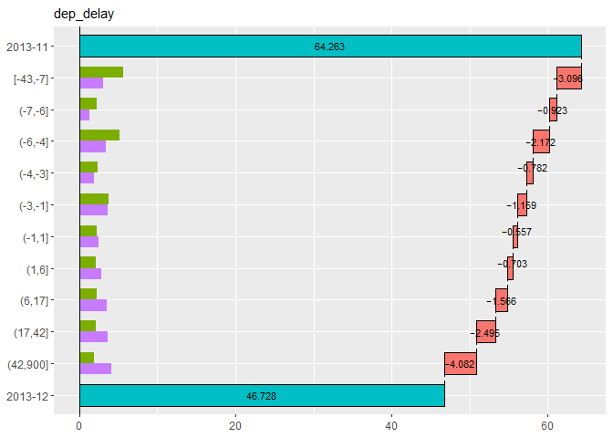

<!-- README.md is generated from README.Rmd. Please edit that file -->

# Theseus Plot: Visualizing Differences through Replacement in Rate Metrics

<!-- badges: start -->

<!-- badges: end -->

## 1. Overview

In data analysis, differences in metrics between groups often prompt
questions about which attributes are responsible for the observed
variation. For instance, in A/B testing, you might want to assess
whether gender differences contribute to the observed change in a key
metric. However, such analysis becomes challenging when the metrics are
rates, as they cannot be aggregated across attributes in the same way
volume metrics can.

## Installation

You can install the development version of Theseus like so:

``` r
remotes::install_github("hoxo-m/Theseus")
```

## Example

This is a basic example which shows you how to solve a common problem:

``` r
library(dplyr)
library(nycflights13)

data <- flights |> 
  filter(!is.na(arr_delay)) |>
  mutate(on_time = arr_delay <= 0)  # arrived on time

data |> select(year, month, day, origin, dest, carrier, dep_delay, on_time) |> head()
#> # A tibble: 6 × 8
#>    year month   day origin dest  carrier dep_delay on_time
#>   <int> <int> <int> <chr>  <chr> <chr>       <dbl> <lgl>  
#> 1  2013     1     1 EWR    IAH   UA              2 FALSE  
#> 2  2013     1     1 LGA    IAH   UA              4 FALSE  
#> 3  2013     1     1 JFK    MIA   AA              2 FALSE  
#> 4  2013     1     1 JFK    BQN   B6             -1 TRUE   
#> 5  2013     1     1 LGA    ATL   DL             -6 TRUE   
#> 6  2013     1     1 EWR    ORD   UA             -4 FALSE

data1 <- data |> filter(month == 9L)
data2 <- data |> filter(month == 12L)

data1 |> summarise(on_time_rate = mean(on_time)) |> pull(on_time_rate)
#> [1] 0.7465753
data2 |> summarise(on_time_rate = mean(on_time)) |> pull(on_time_rate)
#> [1] 0.4672835
```

``` r
library(Theseus)

ship <- create_ship(data1, data2, y = on_time, labels = c("2013-09", "2013-12"))

ship$table(origin)
#> # A tibble: 3 × 8
#>   origin contrib    n1    n2    x1    x2 rate1 rate2
#>   <chr>    <dbl> <int> <int> <int> <int> <dbl> <dbl>
#> 1 EWR    -0.122   9362  9410  7172  3901 0.766 0.415
#> 2 JFK    -0.0832  8788  8923  6497  4332 0.739 0.485
#> 3 LGA    -0.0740  8860  8687  6496  4393 0.733 0.506
```

``` r
ship$plot(origin)
```


``` r
ship$plot_flip(carrier)
```


``` r
ship$plot_flip(dep_delay)
```


