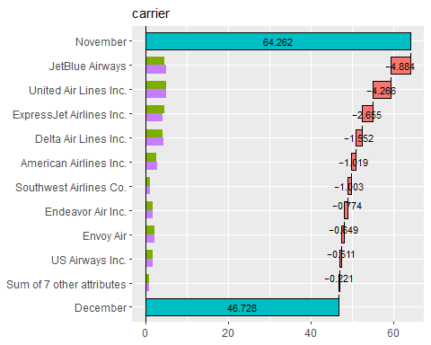

<!-- README.md is generated from README.Rmd. Please edit that file -->

# Theseus

<!-- badges: start -->

<!-- badges: end -->

The goal of Theseus is to …

## Installation

You can install the development version of Theseus like so:

``` r
remotes::install_github("hoxo-m/Theseus")
```

## Example

This is a basic example which shows you how to solve a common problem:

``` r
library(dplyr)
library(nycflights13)

data <- flights |> 
  filter(!is.na(dep_delay)) |>
  mutate(y = dep_delay <= 0)  # on time

data |> select(year, month, day, origin, dest, carrier, y) |> head()
#> # A tibble: 6 × 7
#>    year month   day origin dest  carrier y    
#>   <int> <int> <int> <chr>  <chr> <chr>   <lgl>
#> 1  2013     1     1 EWR    IAH   UA      FALSE
#> 2  2013     1     1 LGA    IAH   UA      FALSE
#> 3  2013     1     1 JFK    MIA   AA      FALSE
#> 4  2013     1     1 JFK    BQN   B6      TRUE 
#> 5  2013     1     1 LGA    ATL   DL      TRUE 
#> 6  2013     1     1 EWR    ORD   UA      TRUE

data1 <- data |> filter(month == 9L)
data2 <- data |> filter(month == 12L)

data1 |> summarise(y = mean(y)) |> pull(y)
#> [1] 0.7118575
data2 |> summarise(y = mean(y)) |> pull(y)
#> [1] 0.5001844
```

``` r
library(Theseus)

ship <- create_ship(data1, data2, labels = c("2013-09", "2013-12"))

ship$table(origin)
#> # A tibble: 3 × 6
#>   items    mean     min     max size1 size2
#>   <chr>   <dbl>   <dbl>   <dbl> <int> <int>
#> 1 EWR   -0.0953 -0.0953 -0.0953  9407  9445
#> 2 JFK   -0.0589 -0.0591 -0.0587  8816  8963
#> 3 LGA   -0.0574 -0.0578 -0.0571  8899  8702
```

``` r
ship$plot(origin)
```


``` r
ship$plot_flip(carrier)
```


