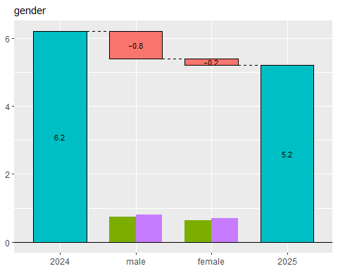
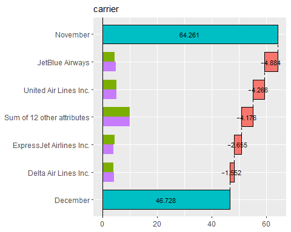

<!-- README.md is generated from README.Rmd. Please edit that file -->

# Theseus Plot: Visualizing Differences through Replacement in Rate Metrics

<!-- badges: start -->

<!-- badges: end -->

## 1. Overview

In data analysis, when a metric differs between two groups, we sometimes
want to investigate whether a particular subgroup is driving that
difference. For example, when a key metric decline is detected compared
to the previous year, you may want to conduct a more detailed analysis.
In this analysis, you may focus on gender among the attributes and
examine whether the decline occurred among male, female, or both.
However, this type of analysis is challenging when the metric is a rate,
because the magnitude of each subgroup’s contribution to the rate cannot
be simply calculated, unlike in the case of volume metrics.

To address this issue, we propose an approach inspired by the story of
the *[Ship of Theseus](https://en.wikipedia.org/wiki/Ship_of_Theseus)*.
This approach involves gradually replacing the components of one group
with those of another, recalculating the metric at each step. The change
in the metric at each step can then be interpreted as the contribution
of each subgroup to the overall difference.

For instance, suppose the metric was 6.2% in 2024 and decreased to 5.2%
in 2025. Again, we focus on gender. We replace the male data within the
2024 dataset with the male data from 2025 and recalculate the metric. As
a result, the metric would drop by 0.8 percentage points, reaching 5.4%.
In this case, the contribution of the male group to the change in the
metric is -0.8 percentage points. Next, we replace the female data from
2024 with that from 2025. The dataset then consists entirely of 2025
data, and the metric drops by 0.2 percentage points, reaching 5.2%.
Thus, the contribution of the female group is -0.2 percentage points.

When visualized, the results appear as follows:



From this plot, we can see that the decline in the metric is primarily
driven by the male group. We call this visualization the “Theseus Plot.”

The **Theseus** package is designed to make it easy to generate Theseus
Plots for various attributes.

## 2. Installation

You can install the development version from GitHub with:

``` r
remotes::install_github("hoxo-m/Theseus")
```

## 3. Details

This is a basic example which shows you how to solve a common problem:

### 3.1 Prepare Data

``` r
library(dplyr)
library(nycflights13)

data <- flights |> 
  filter(!is.na(arr_delay)) |>
  mutate(on_time = arr_delay <= 0) |>  # arrived on time
  left_join(airlines, by = "carrier") |>
  mutate(carrier = name) |>
  select(year, month, day, origin, dest, carrier, dep_delay, on_time)

data |> head()
#> # A tibble: 6 × 8
#>    year month   day origin dest  carrier                dep_delay on_time
#>   <int> <int> <int> <chr>  <chr> <chr>                      <dbl> <lgl>  
#> 1  2013     1     1 EWR    IAH   United Air Lines Inc.          2 FALSE  
#> 2  2013     1     1 LGA    IAH   United Air Lines Inc.          4 FALSE  
#> 3  2013     1     1 JFK    MIA   American Airlines Inc.         2 FALSE  
#> 4  2013     1     1 JFK    BQN   JetBlue Airways               -1 TRUE   
#> 5  2013     1     1 LGA    ATL   Delta Air Lines Inc.          -6 TRUE   
#> 6  2013     1     1 EWR    ORD   United Air Lines Inc.         -4 FALSE

data1 <- data |> filter(month == 11)
data2 <- data |> filter(month == 12)

data1 |> summarise(on_time_rate = mean(on_time)) |> pull(on_time_rate)
#> [1] 0.6426161
data2 |> summarise(on_time_rate = mean(on_time)) |> pull(on_time_rate)
#> [1] 0.4672835
```

``` r
library(Theseus)

ship <- create_ship(data1, data2, y = on_time, labels = c("2013-11", "2013-12"))

ship$table(origin)
#> # A tibble: 3 × 8
#>   origin contrib    n1    n2    x1    x2 rate1 rate2
#>   <chr>    <dbl> <int> <int> <int> <int> <dbl> <dbl>
#> 1 EWR    -0.0831  9603  9410  6251  3901 0.651 0.415
#> 2 JFK    -0.0565  8645  8923  5702  4332 0.660 0.485
#> 3 LGA    -0.0358  8723  8687  5379  4393 0.617 0.506
```

``` r
ship$plot(origin)
```


``` r
ship$plot_flip(carrier)
```


``` r
ship$plot_flip(dep_delay)
```


