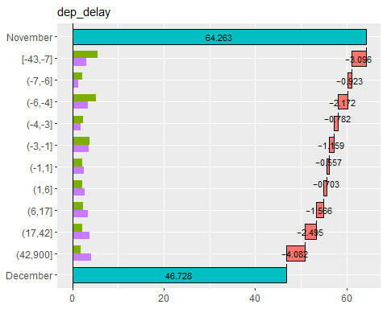

<!-- README.md is generated from README.Rmd. Please edit that file -->

# Theseus Plot: Visualizing Differences through Replacement in Rate Metrics

<!-- badges: start -->

<!-- badges: end -->

## 1. Overview

In data analysis, when there is a difference in a metric between two
groups, we sometimes want to investigate whether there is a subgroup
responsible for that difference. For example, if a certain metric has
declined compared with the previous year, you may want to know whether
the decline occurred among men, women, or both. However, such analysis
becomes challenging when the metric is a ratio, because unlike volume
metrics, ratios cannot be simply aggregated by attribute.

To address this issue, we propose an approach based on the story of the
“Ship of Theseus.” This approach involves gradually replacing the
components of one group with those of another, calculating the metric at
each step. The difference in the rate metric at each step can be
regarded as the contribution of each subgroup to the overall metric.

Now, we suppose the metric was 6.2% in 2024 and decreased to 5.2% in
2025. And, we suppose that if the male data in 2024 replace with the
male data from 2025 and recalculate the metric, the value decreases by
0.8% to 5.4%. In this case, the contribution of the male group to the
metric change is -0.8%. Furthermore, we replace the female data from
2024 with that from 2025, the dataset will consist entirely of 2025
data. Therefore, the metric is 5.2%, which is 0.2% lower than 5.4%, so
the contribution of the female group is -0.2%.

When visualized as a graph, it looks as follows.


From this graph, we can see that the decline in the metric is largely
attributable to the male group. We named this graph the “Theseus Plot.”

The **Theseus** package is designed to easily generate Theseus Plots for
various attributes.

## 2. Installation

You can install the development version from GitHub with:

``` r
remotes::install_github("hoxo-m/Theseus")
```

## 3. Details

This is a basic example which shows you how to solve a common problem:

``` r
library(dplyr)
library(nycflights13)

data <- flights |> 
  filter(!is.na(arr_delay)) |>
  mutate(on_time = arr_delay <= 0)  # arrived on time

data |> select(year, month, day, origin, dest, carrier, dep_delay, on_time) |> head()
#> # A tibble: 6 × 8
#>    year month   day origin dest  carrier dep_delay on_time
#>   <int> <int> <int> <chr>  <chr> <chr>       <dbl> <lgl>  
#> 1  2013     1     1 EWR    IAH   UA              2 FALSE  
#> 2  2013     1     1 LGA    IAH   UA              4 FALSE  
#> 3  2013     1     1 JFK    MIA   AA              2 FALSE  
#> 4  2013     1     1 JFK    BQN   B6             -1 TRUE   
#> 5  2013     1     1 LGA    ATL   DL             -6 TRUE   
#> 6  2013     1     1 EWR    ORD   UA             -4 FALSE

data1 <- data |> filter(month == 9L)
data2 <- data |> filter(month == 12L)

data1 |> summarise(on_time_rate = mean(on_time)) |> pull(on_time_rate)
#> [1] 0.7465753
data2 |> summarise(on_time_rate = mean(on_time)) |> pull(on_time_rate)
#> [1] 0.4672835
```

``` r
library(Theseus)

ship <- create_ship(data1, data2, y = on_time, labels = c("2013-09", "2013-12"))

ship$table(origin)
#> # A tibble: 3 × 8
#>   origin contrib    n1    n2    x1    x2 rate1 rate2
#>   <chr>    <dbl> <int> <int> <int> <int> <dbl> <dbl>
#> 1 EWR    -0.122   9362  9410  7172  3901 0.766 0.415
#> 2 JFK    -0.0832  8788  8923  6497  4332 0.739 0.485
#> 3 LGA    -0.0740  8860  8687  6496  4393 0.733 0.506
```

``` r
ship$plot(origin)
```


``` r
ship$plot_flip(carrier)
```


``` r
ship$plot_flip(dep_delay)
```


